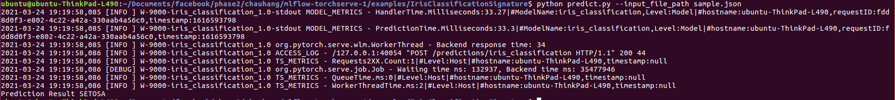
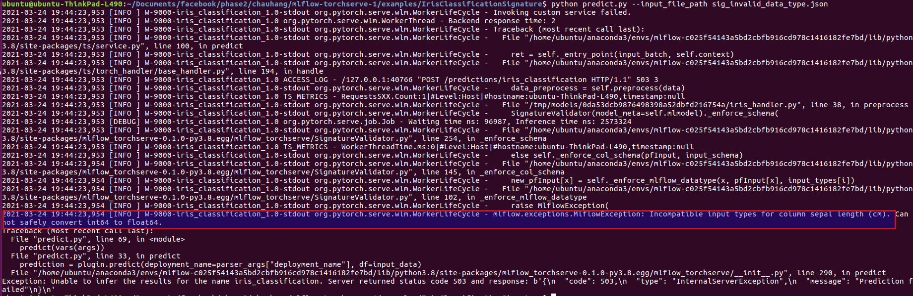

# Deploying Iris Classification using TorchServe

The code, adapted from this [repository](http://chappers.github.io/2020/04/19/torch-lightning-using-iris/),
This example illustrates the process of logging the model signature and performing validations during the deployment phase.
The model is trained using all the IRIS dataset features namely sepal-length,sepal-width,petal-length,petal-width. On train completion, the model along with its signature is saved using `mlflow.pytorch.save_model`
After deployment, the model first validates the input signature and predicts the test input as belonging to one of the IRIS flower species namely SETOSA` , `VERSICOLOR`, `VIRGINICA`.

### Running the code

To run the example via MLflow, navigate to the `examples/IrisClassification/` directory and run the command

```
mlflow run .

```

This will run `iris_classification.py` with the default set of parameters such as `--max_epochs=100`. You can see the default value in the MLproject file.

In order to run the file with custom parameters, run the command

```
mlflow run . -P max_epochs=X
```

where X is your desired value for max_epochs.

If you have the required modules for the file and would like to skip the creation of a conda environment, add the argument --no-conda.

```
mlflow run . --no-conda
```

To run it in gpu, use the following command

```
mlflow run . -P gpus=2 -P accelerator="ddp"
```

At the end of the training process, the model and its signature is saved in `model` directory.

## Starting TorchServe

Create an empty directory `model_store` and run the following command to start torchserve.

`torchserve --start --model-store model_store`

## Creating a new deployment

Run the following command to create a new deployment named `iris_classification`

`python create_deployment.py --extra_files "index_to_name.json,model/MLmodel"`

The default parameters are set in the create_deployment.py script. The arguments can be overriden by parser arguments. 

For example:

`python create_deployment.py --deployment_name iris_classification_1`

Note:
MLFlow stores the model signature inside MLmodel file and it is important to pass the MLmodel path as an EXTRA_FILE argument to create_deployment script.

## Validating the model signature and running prediction based on deployed model

IrisClassification model takes 4 different parameters - sepal length, sepal width, petal length and petal width.T

For testing [iris dataset](http://archive.ics.uci.edu/ml/datasets/Iris/), we are going to use a sample input tensor placed in `sample.json` file.

Run the following command to invoke prediction of our sample input, whose output is printed in the console.

`python predict.py --input_file_path sample.json`

`mlflow-torchserve-plugin` validates the input data against the model signature saved during the training process. 

Following are the enforcements made during the model signature validation process

1. Number of columns present in the input - In this example, the number of columns is 4.
2. The column names should match the names specified in the model signature (i.e during training process). The column names for iris classification examples are expected to be `sepal length (cm)`, `sepal width (cm)`, `petal length (cm)`, `petal width (cm)`
3. The input values must match the datatype specified in model signature - In this example the input values must be `double`

If any of the above mentioned enforcements fails, the validation exception is raised.

`sample.json` is created with align to all the enforcements. 

To know more about the model signature implementation in details, check the `iris_handler.py` and 'mlflow_torchserve/SignatureValidator.py'

The model will classify the flower species based on the input test data as one among the three types. A sample output is shown as below.




To understand the model signature and its output, the following sample files are created. Run the following command to see the validation errors.

`python predict.py --input_file_path sig_invalid_column_name.json`

When the input column name doesn't match with the model signature, validation exception is thrown as below.


`python predict.py --input_file_path sig_invalid_column_name.json`

When the input data type doesn't match with the model signature, validation exception is thrown as below.

